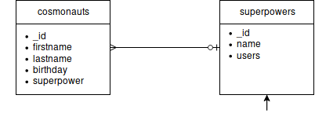
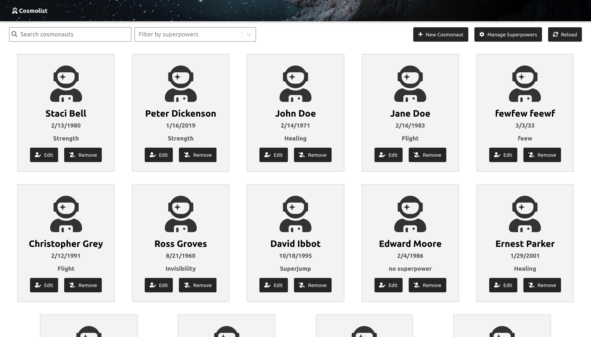
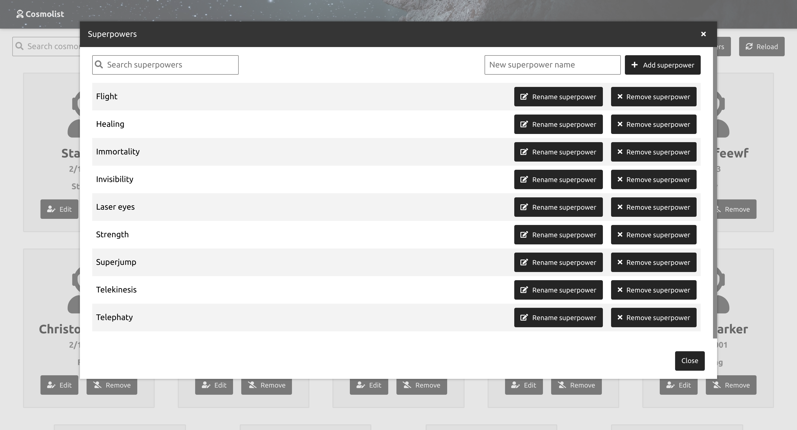
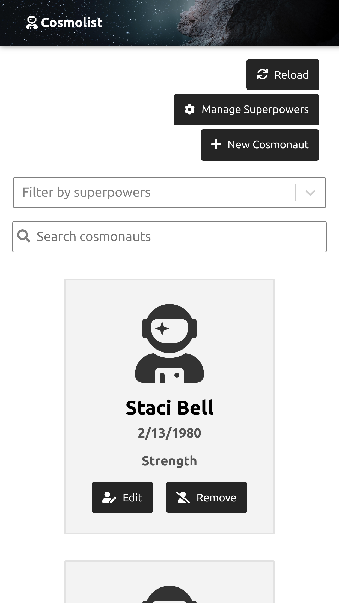
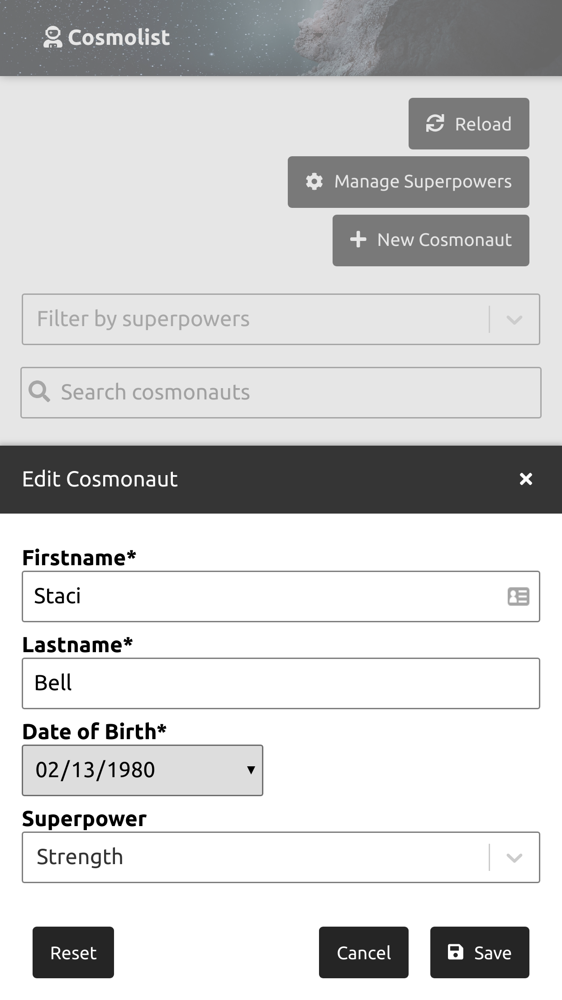

# Cosmolist - elektronická evidence kosmonautů

Jedná se o webovou aplikaci sestávající se z frontendu v React.js komunikujícího prostřednictvím GraphQL API s jednoduchým backendem napsaným v Node.js. Data jsou uložena v MongoDB.
Aplikace je dostupná online na adrese https://cosmolist.herokuapp.com/.

## Backend a databáze
Kód dostupný na https://github.com/asuba512/Cosmolist-backend.

Backend zprostředkovává jednoduchá aplikace v Node.js spolu s GraphQL API knihovnou. Komunikaci s MongoDB databází provádí Mongoose knihovna.

Samotná databáze je velmi jendoduchá a obsahuje pouze dvě tabulky: `cosmonauts` a `superpowers`. 

Tabulka `cosmonauts` ukládá všechna požadovaná data. Superschopnost je uložena jako reference na záznam v tabulce `superpowers`. Kosmonaut také nemusí mít žádnou evidovanou superschopnost.

Tabulka `superpowers` kromě jména superschopnosti ukládá také seznam kosmonautů, kteří touto superschopností disponují.

GraphQL API poskytuje dvě query (`cosmonauts`, `superpowers`) a šest mutací (pro přidání/úpravu/odebrání záznamu do obou tabulek).

## Frontend
Kód dostupný na https://github.com/asuba512/Cosmolist-frontend.

Frontend byl vytvořen v React.js jako SPA. UI se skládá z navigační lišty a okna pro obsah.

Pro rozsah zadání postačovala pouze jediná stránka, která obsahuje samotnou evidenci kosmonautů doplněnou o několik modálních oken pro jednotlivé operace. I přes existenci pouze jediné stránky byla navigační lišta ponechána, například pro účely případného rozšíření o autentizaci, správu uživatelského účtu, nápovědu apod.

Samotný seznam evidovných kosmonautů je řešen jako mřížka "karet" kosmonautů s ikonou, evidovanými informacemi a tlačítky pro manimulaci (úprava, odstranění). Ikona kosmonauta slouží jako placeholder pro případné rozšíření o profilové fotografie kosmonautů.

Nad seznamem kosmonautů se nachází filtrovací a ovládací prvky celé evidence. Zejména pole pro vyhledávání, filtrování podle superschopností, tlačítko pro přidání nového kosmonauta do evidence a správa superschopností.

Formulář pro přidání nového kosmonauta je stejný jako editační formulář a je řešen pomocí modálního okna. Volba superschopnosti je implementována jako select menu s vyhledávání. V případě neexistence hledané superschopnosti, je možné ji rychle přidat přímo z těchto formulářů.

Pokročilé úpravu evidovaných superschopností je možné provádět ve správě superchopností, která je opět řešena jako modální okno. Zde se nachází pole pro vyhledávání a pro přidávání nových superschopností. Dále seznam superschopností s tlačítky pro přejmenování či odstranění superschopnosti.
 
Uživatelské rozhraní je do jisté míry responzivní a je použitelné i na mobilních zařízeních - viz přiložené screenshoty nebo v samotné aplikaci na odkazu výše. 

