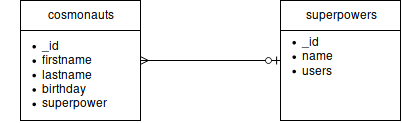

# Cosmolist - elektronická evidence kosmonautů

Jedná se o webovou aplikaci sestávající se z frontendu v React.js komunikujícího prostřednictvím GraphQL API s jednoduchým backendem napsaným v Node.js. Data jsou uložena v MongoDB.
Aplikace je dostupná online na adrese https://cosmolist.herokuapp.com/.

## Backend a databáze
Backend zprostředkovává jednoduchá aplikace v Node.js spolu s GraphQL API knihovnou. Komunikaci s MongoDB databází provádí Mongoose knihovna.

Samotná databáze je velmi jendoduchá a obsahuje pouze dvě tabulky: `cosmonauts` a `superpowers`. 

Tabulka `cosmonauts` ukládá všechna požadovaná data. Superschopnost je uložena jako reference na záznam v tabulce `superpowers`. Kosmonaut také nemusí mít žádnou evidovanou superschopnost.

Tabulka `superpowers` kromě jména superschopnosti ukládá také seznam kosmonautů, kteří touto superschopností disponují.

GraphQL API poskytuje dvě query (`cosmonauts`, `superpowers`) a šest mutations (pro přidání/úpravu/odebrání záznamu do obou tabulek).

## Frontend
